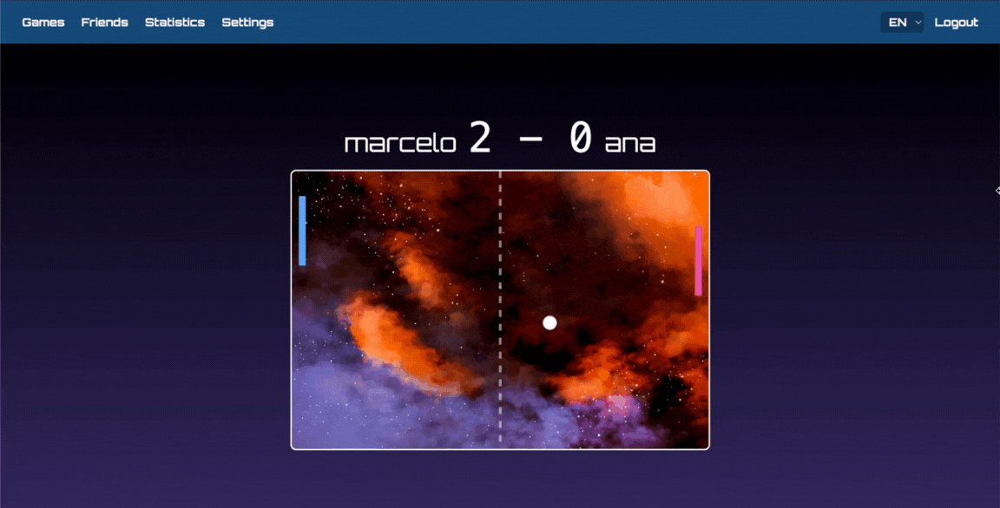

<h1 align=center>
 42_FT_TRANSCENDENCE 🚀
</h1>

  A full-stack application that brings the classic Pong to life with modern features: secure authentication, multiplayer modes, user friendships, a statistics system, AI opponents and much more!

 
 

# STACK 🔨
- **Backend:** Node.js with Fastify  
- **Frontend:** TypeScript with TailwindCSS  
- **Database:** SQLite with Prisma ORM for secure and efficient data management  
- **Containerization & DevOps:** Docker for consistent and portable environments  
- **Infrastructure:** Nginx as a reverse proxy

# About ✍
 Sendo o ultimo projeto do curso da 42, o ft_transcendence representa mais que o fim de um percurso, mostrando o quanto evoluimos desde o inicio da jornada, o quanto nos tornamos capazes de aprender e dominar tecnologias antes nao conhecidas para resolver problemas, mostrando a nossa capacidade de adaptacao frente aos desafios. Portanto, tendo toda a base do Common Core em C, C++ e Shell... agora exploramos o mundo do Web Development, com tecnologias como Typescript, Node.js e frameworks como Fastify e TailwindCSS.
 A parte obrigatoria do projeto se baseia no desenvolvimento de um website sendo um Single Page Application (SPA), onde o usuario seja capaz de jogar Pong contra outro jogador ou em modo torneio. Tambem deve existir um sistema de registro e autenticação de usuarios, sendo protegido de SQL Injections e XSS attacks. Isso tudo nos dá 25% do projeto. A partir disso, podemos escolher entre diversos modulos disponiveis, onde cada major module vale 10 pontos, e os minors, 5. Um mínimo de 7 majors é required para completar o projeto. Os modulos escolhidos estao descritos a seguir.

 # Modules 
 ## Web
 ### MAJOR - Use a framework to build the back-end
 Fastify com Node.js foi utilizado para a contruçao do back-end
 ### MINOR - Use a framework or toolkit to build the front-end
 TailwindCSS em adiçao ao TypeScript foi utilizado no front end
 ### MINOR - Use a database for the backend - and more
 SQLite foi a base de dados, com suporte de Prisma ORM para secure and efficient data management 
 ## User Management
 ###  MAJOR: Standard user management, authentication and users across tournaments
 Users can register, login... 
 
