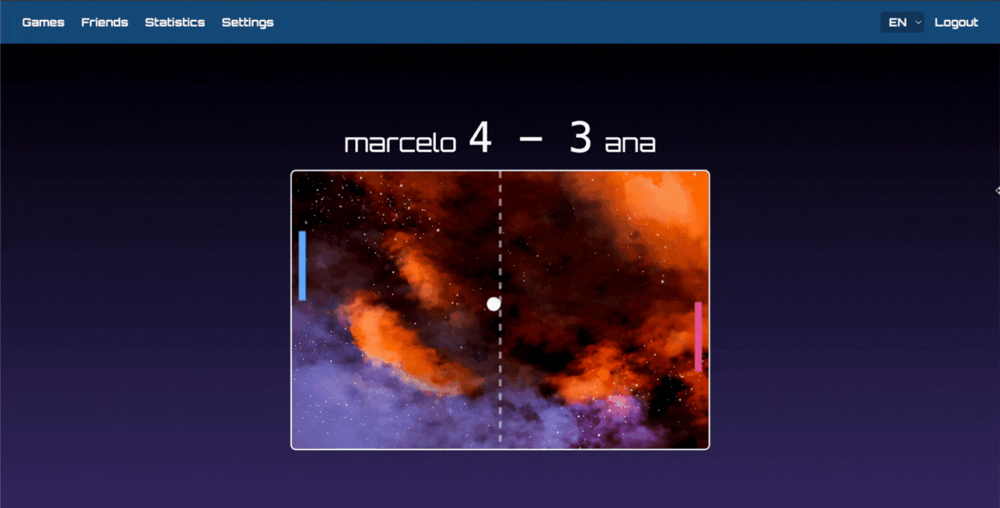

<h1 align=center>
 42_FT_TRANSCENDENCE 🚀
</h1>

  A full-stack application that brings the classic Pong to life with modern features: secure authentication, multiplayer modes, user friendships, a statistics system, AI opponents and much more!

 
 

# STACK 🔨
- **Backend:** Node.js with Fastify  
- **Frontend:** TypeScript with TailwindCSS  
- **Database:** SQLite with Prisma ORM for secure and efficient data management  
- **Containerization & DevOps:** Docker for consistent and portable environments  
- **Infrastructure:** Nginx as a reverse proxy

# About ✍
As the final project of the 42 curriculum, ft_transcendence represents more than just the end of a journey. It showcases how much we have grown since the beginning, proving our ability to learn, adapt, and master new technologies to solve real-world problems.  
While our foundation was built on C, C++, and Shell, this project pushed us into the world of Web Development with tools like TypeScript, Node.js, Fastify, and TailwindCSS.  
The mandatory part of the project required us to build a Single Page Application (SPA) where users can play Pong in different modes, register accounts, and authenticate securely against common threats such as SQL injections and XSS attacks. Beyond this base, we expanded the project by implementing additional major and minor modules, each bringing new challenges and opportunities to explore. They are all described below.

 ### Major Modules
 - **WEB:** Use a framework to build the back-end
 - **USER MANAGEMENT:** Standard user management, authentication and users across tournaments
 - **USER MANAGEMENT:** Implement remote authentication
 - **GAMEPLAY AND USER EXPERIENCE:** Remote players
 - **AI-ALGO:** Introduce an AI opponent
 - **CYBERSECURITY:** Implement Two-Factor Authentication (2FA) and JWT.

### Minor Modules
- **WEB:** Use a framework or toolkit to build the front-end
- **WEB:** Use a database for the backend - and more
- **GAMEPLAY AND USER EXPERIENCE:** Game customization options
- **AI-ALGO:** User and game stats dashboards
- **ACCESSIBILITY:** Expanding browser compatibility
- **ACCESSIBILITY:** Multiple language support

 # Screenshots 📸
